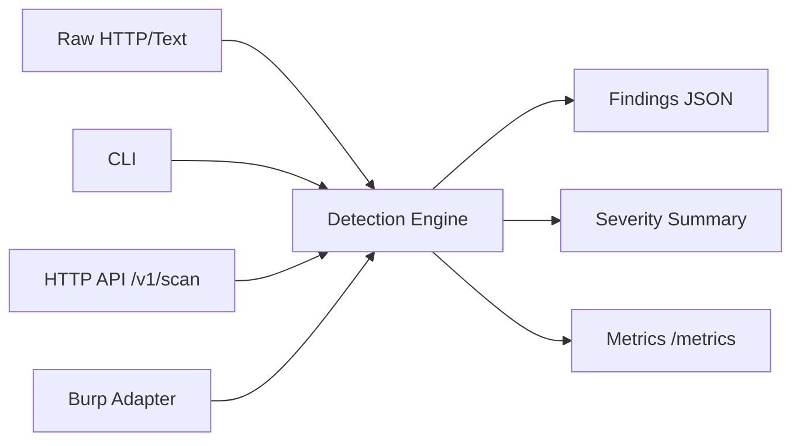

# Data-Leak-Scanner

Deterministic data leak detection engine for HTTP payloads, Burp workflows, and CI pipelines.

## Why this repo matters
Data-Leak-Scanner demonstrates a practical DLP-like workflow for AppSec teams:
- inspect HTTP responses and logs for exposed sensitive data
- produce machine-readable findings for triage and reporting
- run either as CLI, API service, or Burp extension adapter

## Architecture


## Quick start
```bash
python -m venv .venv
.venv/bin/pip install -e '.[dev]'
.venv/bin/data-leak-scanner scan-http --input examples/sample_http_response.txt --output report.json
cat report.json
```

### API mode
```bash
.venv/bin/data-leak-scanner serve --host 0.0.0.0 --port 8086
```

Endpoints:
- `GET /healthz`
- `POST /v1/scan`
- `GET /metrics`

### Docker stack
```bash
make docker-up
```

Services:
- Scanner API: `http://localhost:8086`
- Prometheus: `http://localhost:9096`

## Testing
```bash
make lint
make test
```

## Security
- Policy: `SECURITY.md`
- Threat model: `docs/THREAT_MODEL.md`

## Legacy
Original monolithic Burp script is preserved in `legacy/data_leak_scanner_burp_v1.py`.
