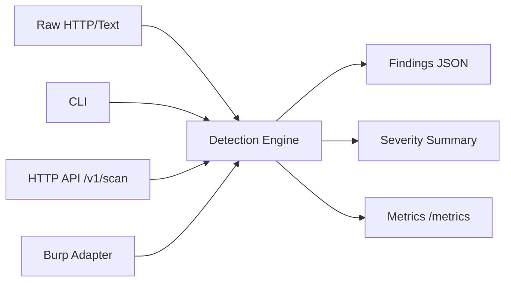

# Data-Leak-Scanner Architecture

## Components
- Scanner core: deterministic + entropy detectors.
- CLI: batch scans in CI/security review workflows.
- HTTP service: `/v1/scan` for platform integration.
- Burp adapter: optional passive scanner bridge.
- Metrics: Prometheus output on `/metrics`.

## Data flow

